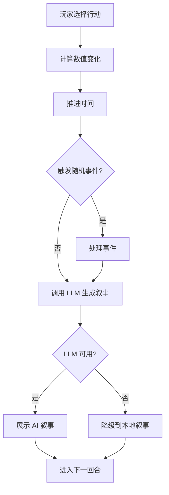

# 一辈子乐队模拟器 · 产品需求文档

## 1. 产品概述

一款接入 LLM 的网页乐队经营模拟游戏。玩家扮演独立乐队成员,通过排练、录音、巡演、运营社交帐号等决策推动乐队发展,核心体验是每次行动后由 AI 生成 150–300 字的叙事正文,描述事件经过与后果。

* 目标用户:喜欢文字向模拟经营、乐队/音乐题材、AI 叙事实验的玩家

* 价值:用固定数据面板保证数值平衡,用 LLM 提供高复玩性的随机叙事,把"经营"和"读故事"结合起来

## 2. 核心功能

### 2.1 用户角色

单一角色:乐队某一(玩家本人),无注册登录。

### 2.2 功能模块

1. **主舞台页**:顶部 HUD + 左侧导航 + 中央叙事正文区 + 右侧上下文面板
2. **乐队档案页**:成员、风格、凝聚力详情
3. **曲目库页**:已有曲目列表与详情
4. **活动中心页**:排练/录音/宣传/休息/巡演选项
5. **演出邀约页**:可接的演出邀请
6. **社交帐号页**:微博/抖音/小红书运营
7. **设置页**:LLM API Key 配置、叙事风格偏好

### 2.3 页面详情

| 页面   | 模块     | 功能描述                              |
| ---- | ------ | --------------------------------- |
| 主舞台  | 顶部 HUD | 显示乐队名、当前日期、资金、名气、凝聚力、当前回合         |
| 主舞台  | 左侧导航   | 切换到档案/曲目/活动/演出/社交/设置子页            |
| 主舞台  | 中央叙事区  | 当前事件标题 + AI 生成的叙事正文 + 历史回看        |
| 主舞台  | 右侧上下文  | 当前回合可用行动、待处理事件、数值变化提醒             |
| 乐队档案 | 成员卡片   | 姓名、年龄、定位、技巧/创造力/凝聚力/心情、薪资,可点击查看详情 |
| 乐队档案 | 风格熟练度  | 摇滚/朋克/独立/电子/民谣等风格的标签              |
| 乐队档案 | 凝聚力系统  | 整体数值 + 状态(完美/良好/紧张/破裂)+ 影响因素      |
| 曲目库  | 曲目列表   | 曲名、风格、ai生成的描述，BPM、难度、人气值、发行日期     |
| 曲目库  | 曲目详情   | 点击展开,显示创作成员、时长、歌词片段、当前在榜情况        |
| 活动中心 | 活动卡片   | 排练/录音/宣传/休息/巡演,显示消耗时间、资金、预期收益     |
| 活动中心 | 行动确认   | 选择活动后弹出确认面板,提交后推进时间并触发叙事          |
| 演出邀约 | 邀约卡片   | 场地、日期、票价预期、观众数预估、酬劳、风险等级          |
| 演出邀约 | 接单流程   | 接受/拒绝,接受后安排曲目与成员,生成演出叙事           |
| 社交帐号 | 平台卡片   | 微博/抖音/小红书,粉丝数、互动率、近期热门帖子          |
| 社交帐号 | 发帖     | 选择平台与内容类型,生成帖子并推进时间               |
| 设置   | API 配置 | LLM 提供商、Base URL、API Key、模型名      |
| 设置   | 叙事偏好   | 叙事长度、风格(写实/戏谑/文艺)、降级开关            |

## 3. 核心流程

### 3.1 主回合循环

1. 玩家查看 HUD 与右侧待办,文字输入行动(活动/接演出/发帖/休息)
2. 系统计算数值变化,推进时间(根据剧情决定推进尺度)
3. 触发随机事件检查,如有事件则进入事件处理子流程
4. 调用 LLM 生成叙事正文,展示在中央叙事区
5. 玩家阅读后进入下一回合

### 3.2 LLM 叙事流程

1. 收集当前回合上下文(乐队状态、行动类型、数值变化、随机事件)
2. 构造 prompt,要求 100~2000 字、符合叙事偏好
3. 调用 LLM API;若未配置或失败,降级到本地模板叙事
4. 渲染正文,自动滚动并加入历史栈

## 4. 用户界面设计

### 4.1 设计风格

**美学方向:Live House 后台 × 黑胶唱片封面 × 音乐杂志排版**

* 主色调:近黑底色 #0E0B0A + 暖琥珀强调色 #E8A33D + 暗红警示色 #C5303A

* 文字色:暖白 #F5EDE0 主文,灰褐 #8B7E6E 次文

* 字体:

  * 标题用 "Cormorant Garamond"(衬线,有杂志感)+ 中文 "Noto Serif SC"

  * 正文用 "Inter Tight" + 中文 "Noto Sans SC"(高密度可读)

  * 数值与代号用等宽 "JetBrains Mono"

* 布局:三栏式(左导航 200px / 中央叙事自适应 / 右上下文 320px),桌面优先

* 装饰:噪点纹理叠加、唱片黑胶纹路背景、磁带卡带式分割线、暖色光晕

* 按钮:方形直角 + 1px 边框 + hover 时琥珀光晕,避免圆角"AI slop"

* 图标:lucide-react,克制使用

### 4.2 页面设计概览

| 页面   | 模块     | UI 元素                               |
| ---- | ------ | ----------------------------------- |
| 主舞台  | HUD    | 顶部固定栏,左侧乐队 Logo + 名称,右侧数值卡片,中间日期与回合 |
| 主舞台  | 中央叙事区  | 大段衬线正文,首字下沉,左侧时间戳竖排,右侧数值变化标注        |
| 主舞台  | 右侧行动面板 | 行动按钮列表,每个含图标/名称/消耗,选中态琥珀边框          |
| 乐队档案 | 成员卡片   | 网格布局,卡片含角色头像占位(首字母大写圆形)、定位徽章、四维数值条  |
| 曲目库  | 曲目列表   | 表格式,每行可展开,左侧小唱片图标按风格着色              |
| 活动中心 | 活动卡片   | 大块卡片,顶部图标,中部描述,底部消耗与收益摘要            |
| 演出邀约 | 邀约卡片   | 风险等级用色块标识(绿/黄/红),场地名称大字突出           |
| 社交帐号 | 平台卡片   | 三列并排,每列顶部平台名 + 粉丝大字数 + 互动率小字        |

### 4.3 响应式

桌面优先(≥1280px 三栏),平板(768–1279px)折叠为双栏 + 抽屉式导航,移动端(<768px)单栏 + 底部 Tab。本版本以桌面体验为主。

### 4.4 3D 场景

不适用。

## 5. 数据与 AI

### 5.1 固定数据面板

* 5 名预设成员(主唱/吉他/贝斯/鼓/键盘),每人 4 维数值

* 6 首预设曲目,覆盖 3–4 种风格

* 5 种风格熟练度初始值

* 初始资金 ¥50,000,名气 10,凝聚力 75,日期 2026-01-01,回合 1

### 5.2 LLM 接入

* 支持自定义 Base URL,兼容 OpenAI Chat Completions 协议

* 前端 localStorage 存储 API Key

* 调用失败自动降级到本地叙事模板(预设 30+ 条按行动类型分类)

### 5.3 数值平衡

* 资金:活动消耗 -¥500 \~ -¥5,000,演出收益 +¥2,000 \~ +¥30,000

* 名气:0–100,演出 +2\~8,发帖 +1\~3,休息 0

* 凝聚力:0–100,排练 +2\~5,巡演 -3\~8,休息 +3\~6

* 成员心情:0–100,受凝聚力与近期事件影响

