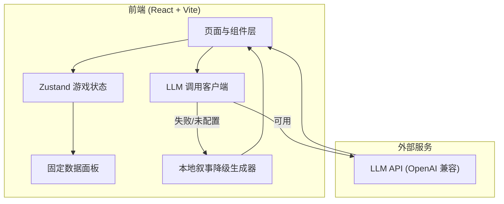
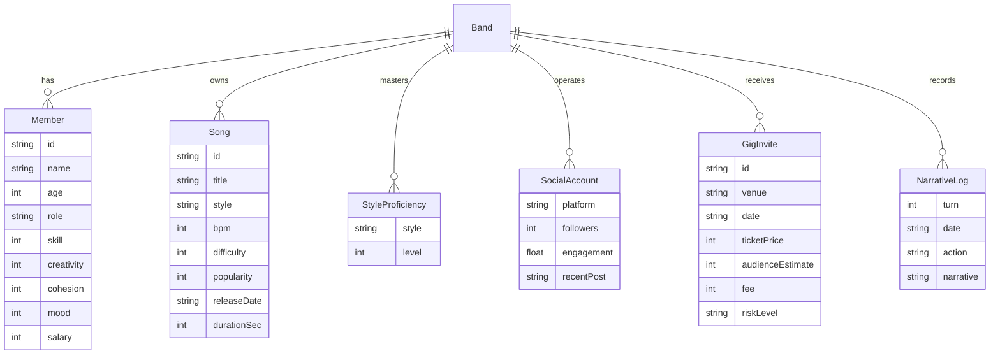

# 一辈子乐队模拟器 · 技术架构文档

## 1. 架构设计

纯前端单页应用,无后端。LLM 调用直接从浏览器发出(玩家在设置页填入自己的 API Key,兼容 OpenAI Chat Completions 协议)。所有游戏数据为前端固定面板,状态保存在 zustand store + localStorage 持久化。



## 2. 技术描述

* 前端:React\@18 + TypeScript + Vite

* 样式:Tailwind CSS\@3 + 自定义 CSS 变量

* 状态管理:zustand(含 persist 中间件用于 localStorage 持久化)

* 路由:react-router-dom\@6

* 图标:lucide-react

* 字体:Google Fonts 引入(Cormorant Garamond / Inter Tight / JetBrains Mono / Noto Serif SC / Noto Sans SC)

* 初始化工具:vite-init,模板 react-ts

* 后端:无

* 数据库:无,固定面板数据写在 src/data

## 3. 路由定义

| 路由          | 用途                    |
| ----------- | --------------------- |
| /           | 主舞台(默认进入,中央叙事 + 右侧行动) |
| /roster     | 乐队档案(成员/风格/凝聚力)       |
| /songs      | 曲目库                   |
| /activities | 活动中心                  |
| /gigs       | 演出邀约                  |
| /social     | 社交帐号                  |
| /settings   | 设置(LLM 配置/叙事偏好)       |

所有路由共享同一套主框架(顶部 HUD + 左侧导航 + 内容区)。

## 4. API 定义(外部 LLM)

LLM 调用封装在 src/services/llm.ts,使用 fetch 直连 OpenAI 兼容协议。

```typescript
interface LLMConfig {
  baseUrl: string;      // 如 https://api.openai.com/v1
  apiKey: string;
  model: string;        // 如 gpt-4o-mini
}

interface NarrativeContext {
  bandName: string;
  date: string;
  turn: number;
  action: string;       // 行动类型
  members: Array<{name: string; role: string; mood: number}>;
  cohesion: number;
  fame: number;
  money: number;
  randomEvent?: string;
  delta: {money?: number; fame?: number; cohesion?: number};
  stylePreference: 'realistic' | 'playful' | 'literary';
  lengthPreference: 'short' | 'medium' | 'long';
}

// 调用 LLM 生成 150–300 字叙事正文
async function generateNarrative(ctx: NarrativeContext, cfg: LLMConfig): Promise<string>;
```

请求体:

```json
{
  "model": "<model>",
  "messages": [
    {"role": "system", "content": "<中文叙事 system prompt>"},
    {"role": "user", "content": "<结构化 context>"}
  ],
  "temperature": 0.9,
  "max_tokens": 600
}
```

降级策略:任何异常(网络错误、未配置、超时 15s、解析失败)均调用 src/services/localNarrative.ts 的模板生成器,保证游戏可玩。

## 5. 服务器架构图

不适用(无后端)。

## 6. 数据模型

### 6.1 数据模型定义



### 6.2 数据定义语言

不使用数据库。固定数据以 TypeScript 常量形式定义在 src/data/:

* src/data/members.ts:5 名成员初始数值

* src/data/songs.ts:6 首曲目

* src/data/styles.ts:5 种风格熟练度

* src/data/social.ts:3 个社交帐号初始状态

* src/data/gigs.ts:5 条初始演出邀约

* src/data/activities.ts:5 种活动定义与消耗

* src/data/randomEvents.ts:15+ 条随机事件

* src/data/localNarratives.ts:30+ 条本地降级叙事模板,按 action 类型分组

游戏运行时状态(zustand store)字段:

```typescript
interface GameState {
  bandName: string;
  date: string;          // YYYY-MM-DD
  turn: number;
  money: number;
  fame: number;
  cohesion: number;
  members: Member[];
  songs: Song[];
  styles: StyleProficiency[];
  social: SocialAccount[];
  gigInvites: GigInvite[];
  narratives: NarrativeLog[];
  pendingEvent?: RandomEvent;
  llmConfig: LLMConfig;
  narrativePreference: {style, length};
  // actions
  performAction: (actionId: string) => Promise<void>;
  acceptGig: (gigId: string) => Promise<void>;
  postSocial: (platform, contentType) => Promise<void>;
  advanceTime: (days: number) => void;
  saveLLMConfig: (cfg: LLMConfig) => void;
  resetGame: () => void;
}
```

